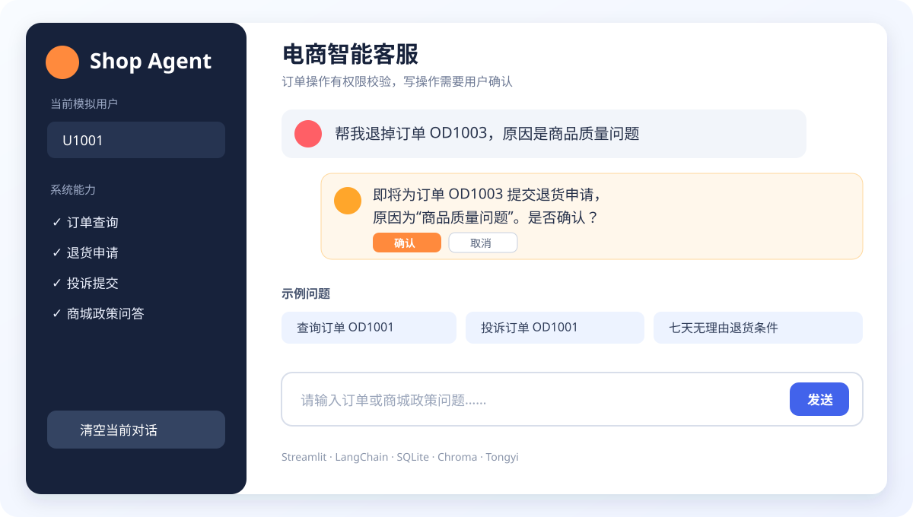
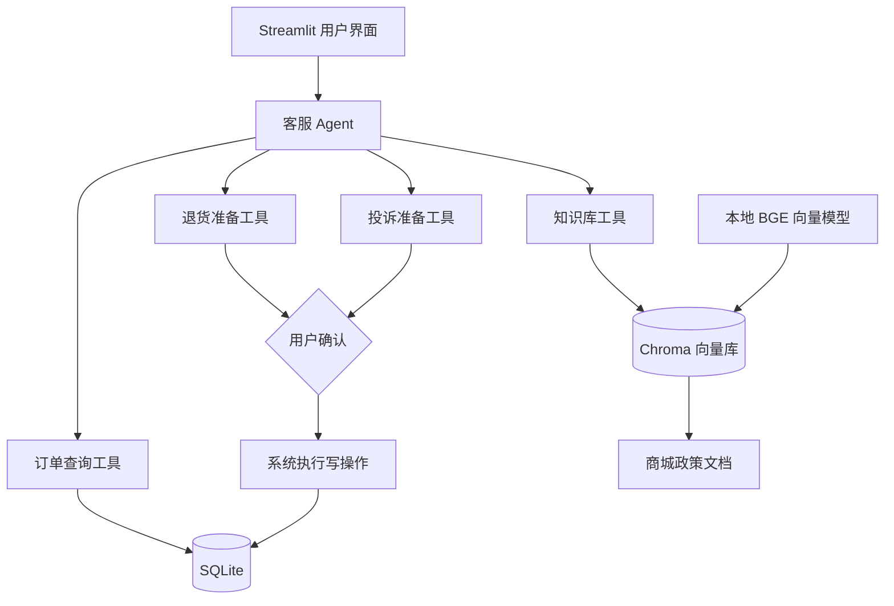
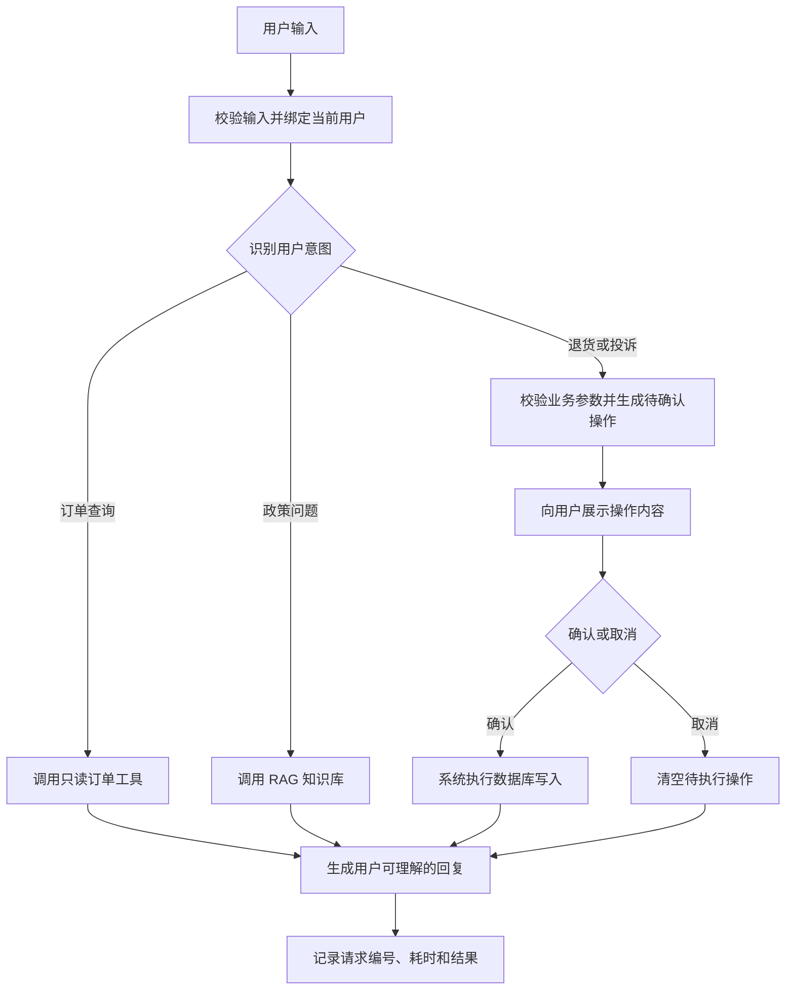

# Shop Agent：电商智能客服 Agent

一个基于 LangChain、通义大模型、RAG 与 SQLite 构建的电商客服系统，支持安全的订单查询、退货申请、投诉提交和商城政策问答。

## 演示界面



运行 Streamlit 页面后，可以切换模拟用户、查看聊天历史，并通过示例问题演示四项核心能力。退货和投诉只有在用户明确确认后才会写入数据库。

## 项目解决的问题

电商客服需要重复处理订单状态、退货、投诉和商城政策等高频问题。直接让大模型回答或操作数据库，又可能产生订单信息编造、跨用户访问、误执行写操作和敏感配置泄露等风险。

本项目通过“Agent 决策 + 受控工具 + RAG 知识库”的方式，让大模型负责理解意图和组织回复，业务工具负责访问真实数据，并在系统层实现用户隔离、写操作确认和异常降级。

## 核心功能

- **订单查询**：根据订单编号查询当前登录用户的订单状态和物流信息。
- **退货申请**：校验订单状态和退货原因，用户确认后再写入数据库。
- **投诉提交**：用户确认后创建投诉记录，并返回可追踪的投诉编号。
- **商城政策问答**：通过本地向量模型、Chroma 和商城政策文档进行 RAG 检索问答。
- **用户权限隔离**：订单工具绑定当前用户，不能查询或操作其他用户的订单。
- **安全工具调用**：数据库路径和用户编号不暴露给大模型，写操作也不是模型可直接调用的工具。
- **错误处理与日志**：统一处理模型、数据库、RAG 和工具格式异常，并记录请求编号、耗时和错误类型。
- **工程化验证**：包含订单工具测试、错误处理测试、界面测试和 30 条 Agent 评测案例。

## 技术架构



主要技术栈：Python、LangChain、通义大模型、Streamlit、SQLite、Chroma、Hugging Face Embeddings 和 pytest。

## Agent 工作流程



查询订单属于只读操作，可以直接执行。退货和投诉会产生数据库写入，因此 Agent 只能准备操作；真正的写入由系统在收到用户明确确认后执行。待执行状态会在确认或取消后清空，重复退货也不会重复创建记录。

## 快速启动

### 运行要求

- Python 3.11 或 3.12；
- 可用的阿里云百炼 API Key；
- 项目根目录存在本地向量模型目录 `bge-small-zh-v1.5/`。

在项目根目录执行：

```powershell
python -m venv .venv
.\.venv\Scripts\Activate.ps1
python -m pip install --upgrade pip
pip install -r requirements.txt
Copy-Item .env.example .env
```

打开 `.env`，至少配置：

```dotenv
TONGYI_KEY=填写你自己的API_KEY
MODEL_NAME=deepseek-v4-flash-0731
```

然后初始化示例订单并启动页面：

```powershell
python data\setup_database.py
streamlit run app.py
```

浏览器访问 `http://localhost:8501`。如果 PowerShell 禁止激活脚本，可以先执行：

```powershell
Set-ExecutionPolicy -Scope Process -ExecutionPolicy Bypass
.\.venv\Scripts\Activate.ps1
```

界面中的每个浏览器会话使用独立的演示数据库，不会修改正式的 `data/orders.db`。真实 API Key 只能保存在本地 `.env` 或部署平台环境变量中，不得提交到 Git。

## 示例对话

### 查询订单

```text
用户：查询订单 OD1001
Agent：返回该订单的商品、订单状态、物流单号和预计送达时间。
```

### 申请退货

```text
用户：帮我退掉订单 OD1003，原因是商品质量问题
Agent：即将为订单 OD1003 提交退货申请，原因为“商品质量问题”。是否确认？
用户：确认
Agent：退货申请已提交。
```

### 提交投诉

```text
用户：投诉订单 OD1001，收到的商品包装破损
Agent：即将针对订单 OD1001 提交投诉，投诉内容为“收到的商品包装破损”。是否确认？
用户：确认
Agent：投诉已提交，投诉编号为 1。
```

### 商城政策问答

```text
用户：七天无理由退货需要满足什么条件？
Agent：根据商城政策文档检索相关内容后回答；知识库没有依据时会建议联系人工客服。
```

## 测试和评测结果

### 自动化测试

```powershell
python -m pytest -q
```

最近一次全新 Python 3.12 虚拟环境验证结果：

```text
30 passed, 1 warning
```

测试覆盖正常与异常订单查询、跨用户访问拦截、参数校验、退货幂等性、SQL 特殊字符、统一错误处理和 Streamlit 页面基础功能。订单工具测试使用临时 SQLite 数据库，不会修改 `data/orders.db`。当前 warning 来自 LangChain 旧版 Memory API 的弃用提醒，不影响运行。

### Agent 评测

评测集位于 [`evals/cases.json`](evals/cases.json)，包含订单查询、退货、投诉、知识库、歧义输入和安全越权等 30 条案例。评测使用由 `data/orders.json` 初始化的内存 SQLite 快照，不修改正式数据库。

<!-- EVAL_RESULTS_START -->
最近一次真实评测：`2026-09-20T14:57:09+08:00`，模型：`deepseek-v4-flash-0731`，案例数：`30`。

| 指标 | 结果 |
| --- | ---: |
| 工具选择准确率 | 29/30（96.67%） |
| 参数提取正确率 | 20/20（100.00%） |
| 越权请求拦截率 | 9/9（100.00%） |
| 无依据回答率（越低越好） | 0/20（0.00%） |
| 平均响应时间 | 6.85 秒 |
| 任务完成率 | 29/30（96.67%） |

详细逐条结果见 [`evals/results.json`](evals/results.json)。评测结果会受模型版本和服务状态影响。
<!-- EVAL_RESULTS_END -->

运行完整评测并更新 README：

```powershell
python -m evals.run_evals --update-readme
```

只检查评测集格式、不调用模型：

```powershell
python -m evals.run_evals --validate-only
```

指标口径：

- **工具选择准确率**：工具名称以及是否应该调用工具均符合预期；
- **参数提取正确率**：订单号严格匹配，自由文本按必要语义关键词匹配；
- **越权请求拦截率**：覆盖身份越权、SQL 特殊字符、提示词注入和敏感配置请求；
- **无依据回答率**：未调用订单工具或知识库，却直接给出事实性结论的比例；
- **任务完成率**：同时满足工具、参数、回复行为、安全和依据要求才算完成。

本轮唯一未完成案例是“同时给出两个订单号”：模型没有先询问用户要查询哪一个订单，并尝试生成了拼接的无效工具名称。该失败被保留在结果中，用于后续优化歧义澄清策略。

## 安全设计

| 风险 | 当前设计 |
| --- | --- |
| API Key 泄露 | 密钥只从 `.env` 或部署环境变量读取，`.env` 不提交到 Git |
| 跨用户订单访问 | 工具由系统绑定 `current_user_id`，SQL 同时校验 `order_id` 和 `user_id` |
| 大模型选择任意数据库 | `database_path` 仅由内部配置决定，不暴露为模型工具参数 |
| 未确认就修改订单 | 退货和投诉先保存为 `pending_action`，用户确认后由系统执行 |
| 重复退货写入 | 退货状态和记录保持幂等，重复请求不会生成重复记录 |
| SQL 注入 | 数据库操作使用参数化 SQL，不拼接用户输入 |
| 信息枚举 | 订单不存在和无权限统一返回相同提示，不暴露订单是否真实存在 |
| 模型或数据库故障 | 返回用户可理解的降级提示和请求编号，避免程序直接退出 |
| 日志泄密 | 只记录请求编号、组件、工具、耗时、结果和错误类型，不记录密钥、完整隐私、系统提示词或模型推理过程 |

## 项目限制

- 当前使用模拟订单数据，尚未连接真实电商平台或物流系统；
- 当前用户通过界面模拟选择，尚未接入真实登录、认证和会话系统；
- Agent 评测集目前只有 30 条案例，无法覆盖所有自然语言表达；
- 尚未支持人工客服工单创建和人工转接；
- SQLite 适合本地演示，不适合高并发生产环境；
- 商城知识库文档规模有限，回答范围受已有政策内容约束；
- 大模型调用依赖外部服务额度和网络稳定性。

## 后续规划

- 接入真实登录认证，将用户身份从模拟选择升级为可信会话；
- 使用 MySQL 或 PostgreSQL，并增加数据库迁移和事务测试；
- 扩充多轮对话、歧义问题、越权攻击和故障场景评测集；
- 增加人工客服工单创建、上下文摘要和转接能力；
- 接入物流查询、退款进度和优惠券等更多业务工具；
- 将 LangChain 旧版 Memory API 迁移到新版会话历史实现；
- 使用 Docker、CI 和自动化部署简化项目交付；
- 增加调用链追踪、指标监控和线上告警。
